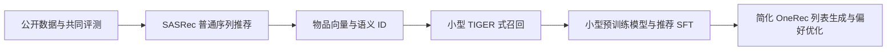

# 项目路线：从普通推荐到生成式推荐

按阶段保留可比较结果，不预设生成式方法必然超过普通基线。

## 阶段 1：普通推荐基线

先完成训练环境与 SASRec，可增加热门推荐和 ItemCF，帮助排查评测流程。
验收：数据可重建，训练与推理正常；记录指标、延迟与配置；仅验证集选模型。

## 阶段 2：小型 TIGER 式召回

处理缺失元数据，用冻结文本编码器离线生成物品向量，训练 RQ-VAE 与语义 ID，
训练小型生成模型预测下一物品 ID，加入合法前缀约束、碰撞处理与去重。
验收：ID 映射一致，生成合法物品；与 SASRec 共用数据与评测；记录码本利用率和碰撞率。

## 阶段 3：预训练模型

从约 1.5B 模型与 LoRA/QLoRA SFT 起步，单独验证预训练是否带来帮助。
处理新增语义 token 的 tokenizer、embedding、输出层训练与保存，再加入文本与 SID 对齐任务。
验收：同任务对比，记录额外成本和真实收益。

## 阶段 4：简化 OneRec

先生成 3～5 个物品的列表，再加入一轮偏好优化。
可以用训练集上训练的 SASRec 作为偏好评分代理，构造 chosen/rejected 列表并尝试 DPO。
这是个人简化设计，不是工业 OneRec 完整复现。
原始 OneRec 的奖励模型与迭代 DPO，同 MiniOneRec 的 SFT/GRPO 流程应区分。
Amazon 评论序列不等于真实曝光列表，列表任务需要另建共同评测。
验收：合法性、列表质量和优化前后对比均有记录；奖励不访问测试答案，教师分数不能替代测试结果。

## 当前起点

数据准备、训练环境、全商品评测适配与 SASRec 首次本地实验已完成。
续训后的 SASRec 测试 Recall@10=0.057650、NDCG@10=0.035554；相同协议下 Popularity Recall@10=0.008949。
第 25 轮因连续过拟合迹象暂停，保留第 23 轮最佳权重。
详细配置、逐轮验证与局限见 [续训记录](../../experiments/sasrec_cpu_extend40_20261007.md)，
[首次实验](../../experiments/sasrec_cpu_20261007.md) 保留作对照。
后续进入物品向量、语义 ID 和小型 TIGER；基线误差与多种子稳定性可在正式结论前补充。
具体实施顺序、样本与生成评测见 [小型 TIGER 实施路线](../04_TIGER/小型TIGER实施路线.md)。
