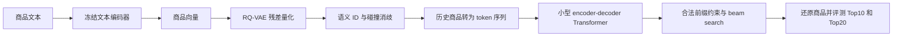

# 小型 TIGER 实施路线

更新时间：2026-10-08。对应脚本已经创建，正在按本文顺序进行本地运行与验收。
代码适配详情和可运行命令见 [TIGER运行说明](../../baselines/tiger/README.md)。正式指标以实验报告为准。
SASRec 当前基线已完成：第 23 轮最佳，全目录测试 HR@10=0.057650、NDCG@10=0.035554。
先完成小型生成式召回，再进入预训练大模型和简化 OneRec。

## 方法从哪里变化

SASRec 编码用户历史得到向量，再与全目录商品 embedding 点积排序。
TIGER 的核心是给每件商品分配一串语义 ID，让序列模型逐个 token 生成下一件商品的 ID。
它仍使用 Transformer，但输出和训练目标变成了离散 ID 序列生成。
论文方法见 [Recommender Systems with Generative Retrieval](https://arxiv.org/abs/2305.05065)。



例子中的 SID 只是示意，不是实际量化结果：

```text
商品 A → [第1层_12, 第2层_35, 第3层_7, 消歧_0]
商品 B → [第1层_12, 第2层_35, 第3层_9, 消歧_0]
商品 C → [第1层_48, 第2层_2,  第3层_11, 消歧_0]

输入：A 的 SID、B 的 SID
标签：C 的 SID
输出：逐 token 生成 C 的完整 SID，再映射回商品 C
```

语义相近的商品可能共享前缀；SID 不是手工分类规则，聚类语义也不保证完美。

## 第一步：商品文本与向量

已有输入为 `data/processed/office2018/items.jsonl`，包含连续 item_id、标题、品牌、
分类、描述与特征；共同划分是 `sequences.jsonl`。保持 25,898 件商品和所有用户划分不变。

1. 固定字段顺序，优先标题、品牌、分类，再拼接描述与特征，统计空文本、重复文本与截断比例。
2. 保留 28 件缺元数据商品，用固定中性占位文本并单独标记，不删除商品、不编造商品属性。
   相同占位文本会产生相同向量，后续通过消歧 token 区分；这些商品没有有效文本语义，应单独报告。
3. 起步拟使用冻结的 [all-MiniLM-L6-v2](https://huggingface.co/sentence-transformers/all-MiniLM-L6-v2)，
   一个约 22.7M 参数、输出 384 维向量的英语编码器；模型卡说明默认截断超过 256 word pieces 的文本。
   下载时固定模型 revision、依赖版本，记录实际 token 上限与归一化方式。
4. 分批在 CPU 上离线编码，保存按 item_id 对齐的向量、映射、文本指纹与模型版本。
   25,898 × 384 的 float32 向量本体约 38MiB，不包含模型和运行内存。

验收：行数与商品目录一致，无 NaN/Inf，无零范数向量；随机核对 ID 对齐，
查看一些商品的文本近邻，确认编码通路正常。近邻相似性不能替代推荐指标。

这一阶段从完整固定目录的商品文本学习表征，但不读取验证/测试评论、目标序列或共购图。
属于固定目录的离线设置，不能据此声称严格时间边界或冷启动泛化。

本机 32GB 内存可先执行小批 CPU 通路；先测一小批的时间与内存，再估算全量任务，
不预先承诺运行时长。当前没有必要先租 GPU 服务器。

## 第二步：RQ-VAE 与语义 ID

RQ-VAE 先把文本向量编码到较小的隐空间，第一层码本拟合隐向量，
后面的码本逐层拟合剩余残差，最终得到多个码本索引。
解码器用量化后的表示重建文本向量；训练包含重建损失与量化相关损失。

个人起步配置拟为 3 层量化、每层 256 个码字、隐空间 32 维，
训练小型 MLP 编码器/解码器。这是待验证的简化配置，不声称与论文超参数一致。
检查重建误差、每层码本利用率、塌缩与原始 SID 碰撞率，再调整配置。

多个商品可能得到相同的三段 ID。为每个碰撞组按固定 item_id 顺序分配第 4 个消歧 token，
非碰撞商品也保留消歧_0，得到固定长度、可唯一反查商品的 ID。
第 4 段只是区分同码商品，不具有前三段相同的语义含义。
每层使用独立 token 命名空间，避免相同整数跨层混淆。

验收：全部商品有 SID，最终 SID 唯一，商品 → SID → 商品的往返一致。
保存码本、SID 映射、版本与校验和；冻结此版本后再训练召回模型。

## 第三步：把行为变成生成样本

沿用 SASRec 的训练/验证/测试划分。训练仅使用训练历史，
对其有效相邻预测位置构造历史前缀 → 下一商品 SID 的样本，
以相同的最近 20 件商品窗口和有效目标范围起步。
当前 SASRec 每轮有 397,345 个有效监督位置，可据此检查生成训练样本数。

若训练历史为 `[A,B,C,D]`：

| 历史输入 | 目标 |
|---|---|
| SID(A) | SID(B) |
| SID(A), SID(B) | SID(C) |
| SID(A), SID(B), SID(C) | SID(D) |

输入最多 20 件商品；每件 4 个 SID token，最多约 80 个语义 token，另计特殊 token。
与 SASRec 相同的是商品历史窗口，token 序列长度会不同。

采用 teacher forcing：训练解码器时提供正确的前缀 token，
逐位置预测下一个 SID token，使用 token 交叉熵并屏蔽 padding。
这种标准生成训练不需要为每个商品另抽一个负例；其监督目标与 SASRec 的正负例 BCE 不同。

验证输入仅训练历史；测试输入为训练历史加验证商品；两者分别预测原来的留出目标。
任何抽样小规模通路结果都标明为检查用途，不能替代完整测试结果。

## 第四步：训练小型生成模型

从随机初始化的小型encoder-decoder Transformer起步。首轮实际采用hidden64、encoder/decoder各1层、2头、FF128，共328,320参数。
hidden128、各2层、4头仍是脚本默认配置，留作后续扩容。已通过真实数据通路、因果/补齐mask、保存恢复和检索合法性检查。
两版均用Adam lr0.001、batch128、seed2026、2个CPU线程、最近20件商品窗口，最多3轮；每轮遍历397,345个有效目标。
模型继承上游T5结构，但没有加载预训练T5权重；前面的MiniLM才是冻结的预训练文本编码器。

上游`train_decoder.py`先加载RQ-VAE权重，通过`SemanticIdTokenizer.precompute_corpus_ids`缓存整数SID，再独立初始化生成模型。
本地`run_tiger.py`直接加载已经导出的SID表；仅生成模型参数进入Adam，量化器不在这次训练图中。
原上游模型只预测前三段语义码；本地子类以`BOS,a,b,c`预测完整`a,b,c,d`，对四个位置的交叉熵取均值。
同一层256个码字参与softmax分类竞争，不额外抽商品负例；层h中的整数t使用`h*256+t`定位独立的token embedding。
两套SID分别配套独立模型与checkpoint，不把EMA映射直接替换进原版模型。

用验证 NDCG@10 选择最佳 checkpoint，沿用明确的提前停止规则。
RQ-VAE 的向量重建检查与推荐模型的验证选模是两种任务，分别记录。

## 第五步：生成商品与共同评测

线上式推理流程：历史商品 → SID → 编码器 → 自回归解码 → 反查商品 → 过滤历史/去重 → TopK。
用全目录 SID 构建前缀树，每一步只允许能通向真实商品的 token，防止生成不存在的 ID。
用 beam search 得到多个候选，以完整 SID 的累积对数概率排序；固定 SID 长度便于比较。

搜索需要考虑已知历史过滤；保证生成后排除完整历史并去重，
首轮固定 beam=20，候选不足20时直接记录输出长度，不用测试答案补候选。
后续可以在验证集比较20、50、100，并建立候选不足时的固定扩展规则，再冻结测试配置。

共同口径保持全部用户、完整目录、原有目标与历史过滤，以及 HR/Recall@10/20、NDCG@10/20。
SASRec 是全目录精确打分排序；有限 beam 的 TIGER 是近似搜索，
“目录和任务相同”不代表检索算法相同，要额外报告 beam width、合法率、重复率、
输出不足 K 的比例与延迟，必要时用更大 beam 做验证集敏感性检查。

第一轮验收是链路完整、生成合法、评测可比较，不预设生成式方法一定超过 SASRec。
多种子复跑与超参数搜索留到通路稳定后，再用于可靠的性能结论。

## 实现顺序与产物

| 次序 | 拟新增入口/产物 | 完成标志 |
|---|---|---|
| 1 | 商品文本检查与 `build_item_embeddings.py` | 全量向量与 item_id 对齐 |
| 2 | `train_rqvae.py`、`build_semantic_ids.py` | 码本记录与唯一 SID 映射 |
| 3 | SID 序列样本与 `run_tiger.py` | 小规模训练、保存恢复与正式训练 |
| 4 | `recommend_tiger.py`、评测适配 | 合法 TopK、共同指标与解码成本 |
| 5 | `experiments/` 的 TIGER 报告 | 和现有 SASRec 并列比较 |

以上入口已创建；执行与检查顺序不变，未完成的正式训练不能被描述为已有成绩。
当前已完成25,898件商品编码、30轮RQ-VAE、四段唯一SID与真实数据训练/推理通路；
原版和EMA SID的hidden64、各1层、2头生成模型均已完成3轮正式训练，各自验证选中第3轮，未触发过拟合暂停。
较早计划的hidden128、各2层保留为脚本默认配置和后续扩容选项；CPU首轮根据负载测试缩小模型。
准备阶段的统计见[验收记录](../../experiments/tiger_setup_20261008.md)，正式测试见[原版报告](../../experiments/tiger_cpu_20261008.md)、[EMA报告](../../experiments/tiger_ema_cpu_20261008.md)与[两版对照](../../experiments/semantic_retrievers_comparison_20261008.md)。
复用 [RQ-VAE-Recommender](https://github.com/EdoardoBotta/RQ-VAE-Recommender) 的量化与T5生成模型；
该项目列出的 Amazon 实验主要是 Beauty/Sports/Toys，不能直接当作我们 Office Products 的实验。
已固定 commit `957d32bda43958ba641ae919abb1092ac6738798` 并保留 MIT 许可证与文件哈希。
上游训练会去掉最后消歧列；本项目保留原文件，通过独立子类训练完整四段ID。
本项目新增确定性前缀树检索、全用户评测、共同样本窗口、逐轮恢复和聚合报告。

向量、权重、SID 映射与用户样本先留本地忽略目录；代码、配置、聚合统计和说明进入 GitHub。
